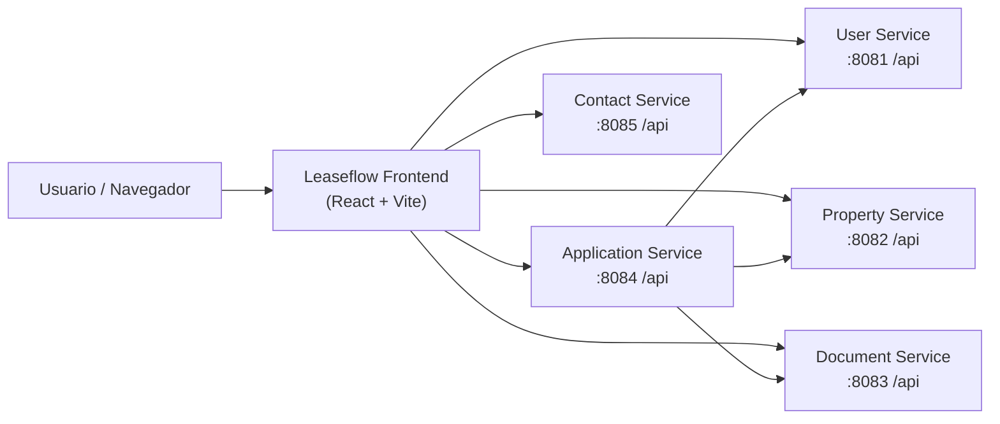
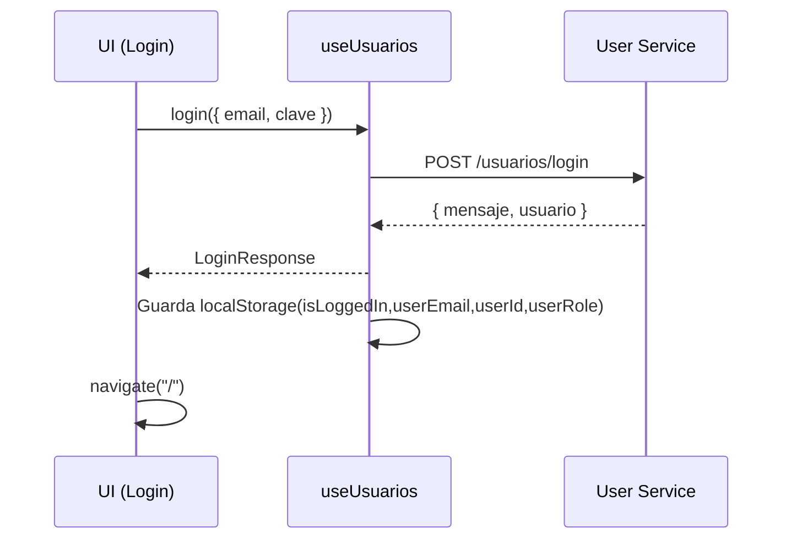
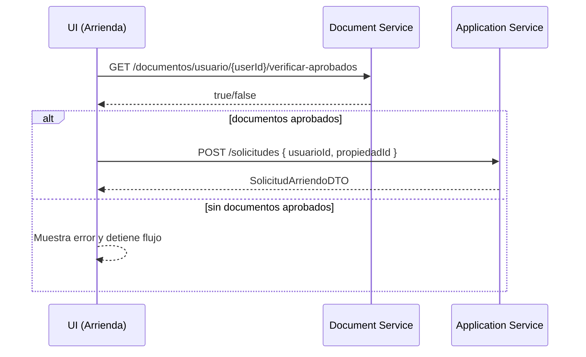

# Leaseflow (Frontend)

Aplicación web SPA para arriendo inmobiliario directo y sin comisiones, construida sobre React, TypeScript y Vite. Este repositorio contiene el frontend de Leaseflow y consume una arquitectura distribuida basada en microservicios HTTP.

## Tabla de contenidos

- [Resumen](#resumen)
- [Versión actual](#versión-actual)
- [Tecnologías](#tecnologías)
- [Arquitectura](#arquitectura)
- [Modelo de datos (DTOs)](#modelo-de-datos-dtos)
- [Ejecución local](#ejecución-local)
- [Scripts](#scripts)
- [Estructura del proyecto](#estructura-del-proyecto)
- [Flujos clave](#flujos-clave)
- [Pruebas y calidad](#pruebas-y-calidad)
- [Troubleshooting](#troubleshooting)

## Resumen

Leaseflow permite:

- Registro e inicio de sesión.
- Visualización de propiedades disponibles y postulación a arriendo.
- Gestión de propiedades por propietario (y vista global para admin).
- Gestión de documentos por el usuario (carga) y revisión por admin (aprobación/rechazo).
- Formulario de contacto integrado con un servicio dedicado.
- Sección de valoraciones integrada con `reviewService`.
- Revisión de postulantes por parte del arrendador con información ampliada de postulante, propiedad y documentos aceptados.
- Gestión administrativa de usuarios, contacto, propiedades, documentos y dashboard.

## Versión actual

Estado actual del paquete según [package.json](file:///c:/Users/jeanf/OneDrive/Documentos/GitHub/LeaseFlow-Web-/package.json):

- Nombre del paquete: `leaseflow`
- Versión actual: `0.0.0`
- Tipo de módulo: `ESM` (`"type": "module"`)
- Estado del frontend: activo y compilando con `npm run build`

## Tecnologías

### Stack principal

| Área | Tecnología | Versión actual |
|---|---|---|
| UI | React | `19.1.1` |
| Render DOM | React DOM | `19.1.1` |
| Routing SPA | React Router DOM | `7.9.4` |
| Bundler / Dev Server | Vite | `7.1.7` |
| Plugin Vite React | `@vitejs/plugin-react` | `5.0.4` |
| Lenguaje | TypeScript | `5.9.3` |
| Estilos UI | Bootstrap | `5.3.8` |

### Calidad y pruebas

| Área | Tecnología | Versión actual |
|---|---|---|
| Lint base | ESLint | `9.36.0` |
| Reglas TS | `typescript-eslint` | `8.45.0` |
| Hooks React | `eslint-plugin-react-hooks` | `5.2.0` |
| Refresh React | `eslint-plugin-react-refresh` | `0.4.22` |
| Testing | Vitest | `4.0.3` |
| DOM Testing | Testing Library React | `16.3.0` |
| Matchers | `@testing-library/jest-dom` | `6.9.1` |
| Entorno tests | jsdom | `27.0.1` |
| Cobertura | `@vitest/coverage-v8` | `4.0.3` |

### Notas técnicas actuales

- El proyecto usa `BrowserRouter` y una SPA con sidebar persistente.
- El frontend trabaja con `localStorage` para estado de sesión y contexto de rol.
- La integración con microservicios usa `fetch` y headers centralizados en [apiConfig.ts](file:///c:/Users/jeanf/OneDrive/Documentos/GitHub/LeaseFlow-Web-/src/config/apiConfig.ts).
- Las respuestas JSON de servicios se normalizan para corregir problemas de codificación UTF-8 cuando el backend devuelve texto mal decodificado.

## Arquitectura

### Vista general

El frontend consume varios microservicios HTTP. Las URLs y headers se centralizan en [apiConfig.ts](file:///c:/Users/jeanf/OneDrive/Documentos/GitHub/LeaseFlow-Web-/src/config/apiConfig.ts).



### Microservicios actuales

| Servicio | Desarrollo | Producción | Propósito |
|---|---:|---|---|
| User Service | Proxy `/userservice/api` | Azure Container Apps | Autenticación, usuarios y estados |
| Property Service | Proxy `/propertyservice/api` | Azure Container Apps | Propiedades, fotos, regiones, comunas y tipos |
| Document Service | Proxy `/documentservice/api` | Azure Container Apps | Documentos, estados y verificación de aprobados |
| Application Service | Proxy `/applicationservice/api` | Azure Container Apps | Solicitudes y registros de arriendo |
| Contact Service | Proxy `/contactservice/api` | Azure Container Apps | Mensajes de contacto |
| Review Service | Proxy `/reviewservice/api` | Azure Container Apps | Reseñas y tipos de reseña |

Notas:

- En desarrollo se trabaja con proxies locales configurados por prefijo.
- En producción las URLs apuntan a Azure Container Apps.
- Todas las requests incluyen `X-App-Client` y las protegidas agregan `X-Usuario-Id` y `X-Rol-Id`.
- Para evitar preflight innecesario, los `GET` y `DELETE` no envían `Content-Type`.

### Routing (SPA)

Las rutas están definidas en [App.tsx](file:///c:/Users/jeanf/OneDrive/Documentos/GitHub/LeaseFlow-Web-/src/App.tsx):

| Ruta | Pantalla | Notas |
|---|---|---|
| `/` | Home | Landing |
| `/nosotros` | Nosotros | Info de la plataforma |
| `/arrienda` | Arrienda | Lista propiedades + postulación |
| `/contacto` | Contacto | Envío de mensaje al Contact Service |
| `/login` | Login | Login contra User Service |
| `/registro` | Registro | Registro + “carga” de documentos |
| `/perfil` | Perfil | Datos del usuario y documentos |
| `/gestion-propiedades` / `/mis-propiedades` / `/gestor-propiedades` | Gestión Propiedades | Según rol |
| `/gestion-documentos` | Gestión Documentos | Admin |
| `/admin` | Dashboard | Admin |
| `/gestion-usuarios` | Gestión de Usuarios | Admin |
| `/gestion-contacto` | Gestión de Contacto | Admin |
| `/mis-solicitudes` | Mis Solicitudes | Arrendatario |
| `/solicitudes-recibidas` | Solicitudes Recibidas | Propietario/Admin |
| `/mis-arriendos` | Mis Arriendos | Arrendatario |
| `/valoraciones` | Valoraciones | Integrada con `reviewService` |

### “Sesión” y permisos (frontend)

El estado de sesión se modela con `localStorage` (no hay JWT en este frontend):

- `isLoggedIn`: `"true" | null`
- `userEmail`: string
- `userId`: string (numérico)
- `userRole`: `"ADMIN" | "PROPIETARIO" | "ARRIENDATARIO"`

La barra de navegación y algunas pantallas realizan validación por rol/estado leyendo estas claves (ej.: [useUsuarios.ts](src/hooks/useUsuarios.ts), [GestionDocumentos.tsx](src/paginas/GestionDocumentos.tsx), [GestionPropiedades.tsx](src/paginas/GestionPropiedades.tsx)).

Nota: esto es control UI, no seguridad real. La autorización efectiva debe estar reforzada en backend.

## Modelo de datos (DTOs)

Los tipos principales del dominio se encuentran en [types/index.ts](src/types/index.ts) y se usan a través de los clientes HTTP en [src/api](src/api).

Entidades relevantes:

- Usuario: `UsuarioDTO` (incluye rol, estado, puntos, duocVip, código de referido).
- Propiedad: `PropiedadDTO` (dirección, precio, m2, habitaciones/baños, fotos, comuna/tipo).
- Documento: `DocumentoDTO` (estadoId, tipoDocId, usuarioId).
- Solicitud de arriendo: `SolicitudArriendoDTO` (estado, usuario, propiedad).
- Registro de arriendo: `RegistroArriendoDTO` (vigencia y monto).
- Contacto: `MensajeContactoDTO` (definido en [contactService.ts](src/api/contactService.ts)).

### Estados y tipos de documento (IDs usados en UI)

- Estados: 1=PENDIENTE, 2=ACEPTADO, 3=RECHAZADO, 4=EN_REVISION (ver [useDocumentos.ts](src/hooks/useDocumentos.ts) y [GestionDocumentos.tsx](src/paginas/GestionDocumentos.tsx))
- Tipos (registro): 1=DNI, 2=Pasaporte, 3=Liquidación, 4=Antecedentes, 5=AFP, 6=Contrato (ver [Registro.tsx](src/paginas/Registro.tsx))

## Ejecución local

### Requisitos

- Node.js 20+ recomendado
- npm 10+ recomendado
- Microservicios disponibles por proxy local o despliegue remoto
- Variable opcional `VITE_APP_CLIENT_KEY` para el header `X-App-Client`

### Instalación y ejecución

```bash
npm install
npm run dev
```

La aplicación quedará disponible en la URL que muestre Vite (por defecto suele ser `http://localhost:5173`).

### Configuración de microservicios

Editar [apiConfig.ts](file:///c:/Users/jeanf/OneDrive/Documentos/GitHub/LeaseFlow-Web-/src/config/apiConfig.ts) para cambiar proxies o URLs productivas si es necesario.

Ejemplo de variable local:

```bash
VITE_APP_CLIENT_KEY=rentify-leaseflow-dev-key-2026
```

## Scripts

Definidos en [package.json](package.json):

```bash
npm run dev       # entorno de desarrollo
npm run build     # build producción (tsc + vite build)
npm run preview   # preview del build
npm run lint      # eslint .
npm run test      # vitest run
npm run test:ui   # vitest (modo watch/UI)
npm run smoke:api # smoke test de endpoints proxificados
```

## Estructura del proyecto

```text
src/
  api/            Clientes HTTP por microservicio
  config/         Config global (URLs, constantes de dominio)
  core/           Manejo centralizado de errores
  hooks/          Hooks de dominio (estado + llamadas a servicios)
  paginas/        Pantallas (rutas)
  test/           Tests (Vitest + Testing Library)
  types/          DTOs y tipos compartidos
  utils/          Utilidades transversales (incluye normalización UTF-8)
  main.tsx        Entry point (BrowserRouter + Bootstrap)
  App.tsx         Router + layout principal con sidebar
```

Notas:

- Alias `@/` hacia `src/` configurado en [vite.config.ts](vite.config.ts).
- Bootstrap se importa en [main.tsx](src/main.tsx) y estilos custom en [App.css](src/App.css).

## Flujos clave

### Login

El login se realiza contra `POST /usuarios/login` del User Service y, si es exitoso, se guarda la “sesión” en `localStorage` (ver [useUsuarios.ts](src/hooks/useUsuarios.ts)).



Mapeo de roles en frontend (según `rolId` del backend):

- `1 -> ADMIN`
- `2 -> PROPIETARIO`
- `3 -> ARRIENDATARIO`

### Registro (2 pasos) + documentos

Registro se divide en:

1. Datos personales + rol + validaciones locales.
2. Documentos (algunos obligatorios) que quedan “pendientes” para revisión.

Importante: actualmente no se sube el archivo como binario; se envía un registro con `nombre` como el nombre del archivo (ver [Registro.tsx](src/paginas/Registro.tsx)). La carga real a storage/BD debe implementarse en backend y/o en el cliente.

### Postulación a arriendo

La postulación desde [arrienda.tsx](src/paginas/arrienda.tsx) valida:

- Usuario logueado (`localStorage`)
- Documentos aprobados (Document Service)
- Creación de solicitud (Application Service)



### Solicitudes recibidas del propietario

La vista de [SolicitudesRecibidas.tsx](file:///c:/Users/jeanf/OneDrive/Documentos/GitHub/LeaseFlow-Web-/src/paginas/SolicitudesRecibidas.tsx) usa `Application Service` como fuente principal de solicitudes y luego cruza datos con `Property Service`, `User Service` y `Document Service` para enriquecer la interfaz del arrendador.

Actualmente muestra:

- Datos completos del postulante.
- Datos completos de la propiedad.
- Documentos aceptados del postulante.
- Acciones para aceptar o rechazar la solicitud.

## Pruebas y calidad

- Tests: se ubican en [src/test](src/test) y se ejecutan con `npm run test`.
- Setup de testing: [setupTests.ts](src/setupTests.ts) (jsdom + matchers).
- Lint: `npm run lint` (config: [eslint.config.js](eslint.config.js)).
- El proyecto compila correctamente con `npm run build`.

## Troubleshooting

- Error “Failed to fetch”: usualmente significa microservicio apagado, proxy mal configurado o CORS no configurado. Verifica que los servicios estén disponibles y que el backend permita requests desde el frontend local.
- “Acceso denegado” en pantallas admin: la UI valida `userRole === ADMIN`. Revisa `localStorage.userRole` y el `rolId` que devuelve el backend.
- “Debes tener al menos un documento aprobado para postular”: el Document Service debe retornar `true` en el endpoint de verificación de aprobados para el usuario.
- Si aparecen textos como `Contraseña` o `¿`, el frontend ya intenta repararlos al normalizar respuestas JSON, pero idealmente el backend debe responder siempre en UTF-8 correcto.
